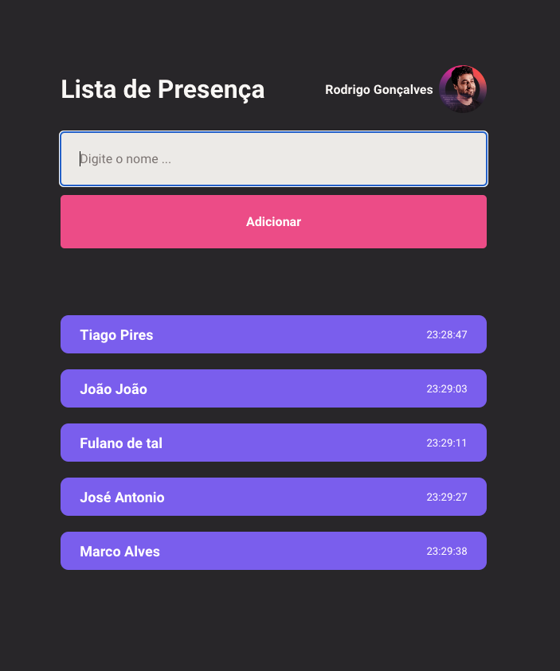

<p align="center">
  <a href="#-layout">Layout</a> •
  <a href="#-technologies">Technologies</a> •
  <a href="#-getting-started">Getting started</a> •
</p>

<p align="center">
  
</p>

## 🚀 Technologies

- [ReactJS](https://reactjs.org/) (useState, useEffect with Async Await-GitHub API)


## 💻 Getting started

### Requirements

- [Node.js](https://nodejs.org/en/)
- [Yarn](https://classic.yarnpkg.com/) or [npm](https://www.npmjs.com/package/npm)

**Clone the project and access the folder**

```bash
git clone git@github.com:tiagopires123/presence-list.git && cd presence-list
```

**Follow the steps below**

```bash
# From the project root folder access the 'server' folder
$ cd presence-list

# Install the dependencies
$ npm install

# Start the server
$ npm run dev
```

---

<p align="center">
  Made with 💜
</p>
